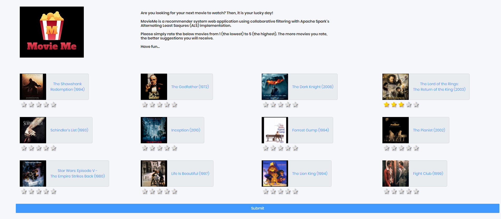
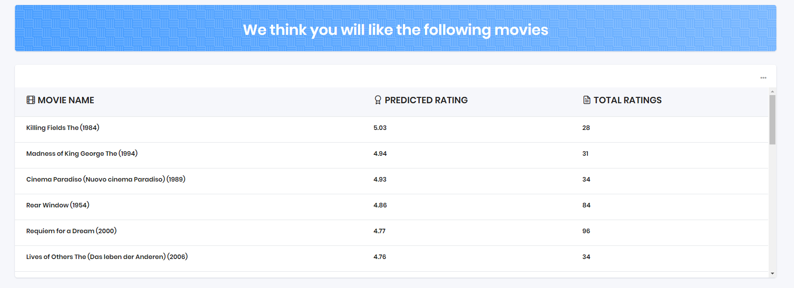

# [MovieMe](http://movieme.eba-xeb4i3qf.us-east-2.elasticbeanstalk.com/)

<br />

## Description

MovieMe is an end-to-end Recommender System web application using Apache Spark, Flask, and Elastic Beanstalk using the [MovieLens](https://movielens.org/)  dataset and collaborative filtering with Spark's Alternating Least Squares implementation. The app can be accessed from the following link: http://movieme.eba-xeb4i3qf.us-east-2.elasticbeanstalk.com/

We defined a timeline of two weeks for the whole project from end to end. 

<table>
  <tr>
    <td>Login Page</td>

  </tr>
  <tr>
    <td>
  </tr>
 </table>

<table>
  <tr>
    <td>Result Page</td>
     <td></td>
  </tr>
  <tr>
    <td></td>
  </tr>
 </table>

This Readme file has the following sections:
1.  [Project Organization](#ProjectOrganization)
2.  [Flask](#Flask)
3.  [AWS Deployment](#AWSDeployment)
4.  [Future Work](#FutureWork)

<br />

## 1. Project Organization <a id='ProjectOrganization'></a>

The pipeline is written as a Python module named MovieMe which is located under app/home directory. This module contains all the necessary functionality from reading the data to building the recommender system and predicting the results.

Here is the different parts of the MovieMe module:

### 1.1. Spark Context Initialization and Reading data

### 1.2. Counting and Averaging Movies' Ratings
`ratings_count_avg` method
### 1.3. Training the Recommender System Model
`train_recommender` and `predict_recommender` methods
### 1.4. Adding New User's Ratings and Making Prediction  
`add_new_user_ratings` and `predict_top_ratings` methods


<br />

## 2. Flask <a id='Flask'></a>


Flask is a lightweight WSGI web application framework for Python. It is designed to make getting started quick and easy, with the ability to scale up to complex applications. It began as a simple wrapper around Werkzeug and Jinja and has become one of the most popular Python web application frameworks.


<br />

## Code-base structure

The project is coded using blueprints, app factory pattern, dual configuration profile (development and production) and an intuitive structure presented bellow:

> Simplified version

```bash
< PROJECT ROOT >
   |
   |-- app/                      # Implements app logic
   |    |-- base/                # Base Blueprint - handles the authentication
   |    |-- home/                # Home Blueprint - serve UI Kit pages
   |    |
   |   __init__.py               # Initialize the app
   |
   |-- requirements.txt          # Development modules - SQLite storage
   |-- requirements-mysql.txt    # Production modules  - Mysql DMBS
   |-- requirements-pqsql.txt    # Production modules  - PostgreSql DMBS
   |
   |-- .env                      # Inject Configuration via Environment
   |-- config.py                 # Set up the app
   |-- application.py                    # Start the app - WSGI gateway
   |
   |-- ************************************************************************
```

<br />

> The bootstrap flow

- `application.py` loads the `.env` file
- Initialize the app using the specified profile: *Debug* or *Production*
  - If env.DEBUG is set to *True* the SQLite storage is used
  - If env.DEBUG is set to *False* the specified DB driver is used (MySql, PostgreSQL)
- Call the app factory method `create_app` defined in app/__init__.py
- Redirect the guest users to Login page 
- Unlock the pages served by *home* blueprint for authenticated users

<br />

> App / Base Blueprint

The *Base* blueprint handles the authentication (routes and forms) and assets management. The structure is presented below:

```bash
< PROJECT ROOT >
   |
   |-- app/
   |    |-- home/                                # Home Blueprint - serve app pages (private area)
   |    |-- base/                                # Base Blueprint - handles the authentication
   |         |-- static/
   |         |    |-- <css, JS, images>          # CSS files, Javascripts files
   |         |
   |         |-- templates/                      # Templates used to render pages
   |               |
   |               |-- includes/                 #
   |               |    |-- navigation.html      # Top menu component
   |               |    |-- sidebar.html         # Sidebar component
   |               |    |-- footer.html          # App Footer
   |               |    |-- scripts.html         # Scripts common to all pages
   |               |
   |               |-- layouts/                  # Master pages
   |               |    |-- base-fullscreen.html # Used by Authentication pages
   |               |    |-- base.html            # Used by common pages
   |               |
   |               |-- accounts/                 # Authentication pages
   |                    |-- login.html           # Login page
   |                    |-- register.html        # Registration page
   |
   |-- requirements.txt                          # Development modules - SQLite storage
   |-- requirements-mysql.txt                    # Production modules  - Mysql DMBS
   |-- requirements-pqsql.txt                    # Production modules  - PostgreSql DMBS
   |
   |-- .env                                      # Inject Configuration via Environment
   |-- config.py                                 # Set up the app
   |-- run.py                                    # Start the app - WSGI gateway
   |
   |-- ************************************************************************
```

<br />

> App / Home Blueprint

The *Home* blueprint handles UI Kit pages for authenticated users. This is the private zone of the app - the structure is presented below:

```bash
< PROJECT ROOT >
   |
   |-- app/
   |    |-- base/                                # Base Blueprint - handles the authentication
   |    |-- home/                                # Home Blueprint - serve app pages (private area)
   |         |
   |         |-- templates/                      # UI Kit Pages
   |               |
   |               |-- index.html                # Default page
   |               |-- page-404.html             # Error 404 page
   |               |-- page-500.html             # Error 500 page
   |               |-- page-403.html             # Error 403 page
   |               |-- *.html                    # All other HTML pages
   |
   |-- requirements.txt                          # Development modules - SQLite storage
   |-- requirements-mysql.txt                    # Production modules  - Mysql DMBS
   |-- requirements-pqsql.txt                    # Production modules  - PostgreSql DMBS
   |
   |-- .env                                      # Inject Configuration via Environment
   |-- config.py                                 # Set up the app
   |-- application.py                                    # Start the app - WSGI gateway
   |
   |-- ************************************************************************
```

<br />

## 3. AWS Deployment <a id='AWSDeployment'></a>

AWS Elastic Beanstalk is a service for deploying and scaling web applications and services developed with Java, .NET, PHP, Node.js, Python, Ruby, Go, and Docker on familiar servers such as Apache, Nginx, Passenger, and IIS.

Elastic Beanstalk automatically handles the capacity provisioning, load balancing, auto-scaling, and application health monitoring.

The following resources are managed by Elastic Beanstalk"

- EC2 instance – An Amazon Elastic Compute Cloud (Amazon EC2) virtual machine configured to run web apps on the platform that you choose.

- Instance security group – An Amazon EC2 security group configured to allow inbound traffic on port 80. This resource lets HTTP traffic from the load balancer reach the EC2 instance running your web app. By default, traffic isn't allowed on other ports.

- Load balancer – An Elastic Load Balancing load balancer configured to distribute requests to the instances running your application. A load balancer also eliminates the need to expose your instances directly to the internet.

- Auto Scaling group – An Auto Scaling group configured to replace an instance if it is terminated or becomes unavailable.

- Amazon S3 bucket – A storage location for your source code, logs, and other artifacts that are created when you use Elastic Beanstalk.

- Amazon CloudWatch alarms – Two CloudWatch alarms that monitor the load on the instances in your environment and that are triggered if the load is too high or too low. When an alarm is triggered, your Auto Scaling group scales up or down in response.

- AWS CloudFormation stack – Elastic Beanstalk uses AWS CloudFormation to launch the resources in your environment and propagate configuration changes. The resources are defined in a template that you can view in the AWS CloudFormation console.

- Domain name – A domain name that routes to your web app in the form subdomain.region.elasticbeanstalk.com.


#### 3.1. How to deploy the app locally:

```bash
$ # Get the code
$ cd MovieMe
$
$ # Virtualenv modules installation (Unix based systems)
$ virtualenv env
$ source env/bin/activate
$
$ # Install modules - SQLite Database
$ pip3 install -r requirements.txt
$
$ # Set the FLASK_APP environment variable
$ export FLASK_APP=application.py

$
$ # Set up the DEBUG environment
$ export FLASK_ENV=development
$
$ # Start the application (development mode) 
$ flask run --host=0.0.0.0 --port=5000
$
$ # Access the dashboard in browser: http://127.0.0.1:5000/
```
#### 3.2. How to deploy the app on AWS Elastic Beanstalk:

1- Initialize your EB CLI repository with the eb init command:

```bash
~/eb-flask$ eb init -p python-3.6 MovieMe --region us-east-2
```

   This command creates a new application named MovieMe and configures your local repository to create environments with the latest Python 3.6 platform version.

2- Run eb init again to configure a default keypair so that you can connect to the EC2 instance running your application with SSH:

```bash
~/eb-flask$ eb init
Do you want to set up SSH for your instances?
(y/n): y
Select a keypair.
1) my-keypair
2) [ Create new KeyPair ]
```


3- Create an environment and deploy your application to it with eb create:

```bash
~/eb-flask$ eb create MovieMe
```

Environment creation takes about 5 minutes. 

4- When the environment creation process completes, open your web site with eb open:

```bash
~/eb-flask$ eb open
```

This will open a browser window using the domain name created for your application. 

5- Resolve the issues on the fly

When deployed the ELB, we git MemorryError when installing PySpark library. We needed to remove pyspark from requirments.txt and install it manually on the EC2 instance using ```--no-cache-dir``` option:

```bash
~/opt/python/run/venv/bin/pip install pyspark==3.0.1 --no-cache-dir
```
We also needed to upgrade Java manually on the EC2 instance because of the error we got when initializing the Spark object.

```bash
~sudo yum install java-1.8.0
~sudo yum remove java-1.7.0-openjdk
```

<br />

## 4. Future Work <a id='FutureWork'></a>

### 4.1. A

<br />

## Credits & Links

- [Flask Framework](https://www.palletsprojects.com/p/flask/) - The offcial website
- [Boilerplate Code](https://appseed.us/boilerplate-code) - Index provided by **AppSeed**
- [AWS Elastic Beanstalk](https://aws.amazon.com/elasticbeanstalk/) - The official website
- [MovieLens](https://movielens.org/) - The official website